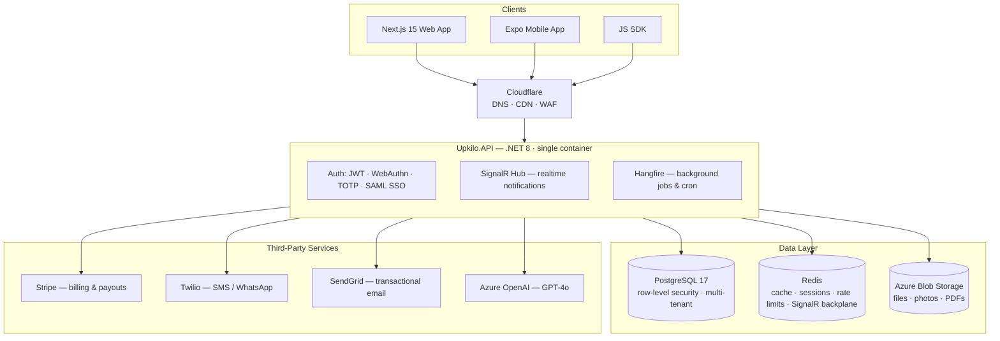

<div align="center">

# Upkilo

### AI-Powered Booking & CRM Platform

**Multi-tenant SaaS for service businesses.** Bookings, CRM, billing, AI automation and analytics in one stack.

[](https://dotnet.microsoft.com/)
[](https://nextjs.org/)
[](https://expo.dev/)
[](https://www.postgresql.org/)
[](https://redis.io/)
[](https://www.docker.com/)

[](#-testing)
[](#-testing)
[](#-testing)
[](#-license)

[Quick Start](#-quick-start) · [Architecture](#-architecture) · [Pricing Model](#-pricing-model) · [Deployment](#-deployment) · [Docs](docs/PRODUCTION_DEPLOYMENT.md)

</div>

---

## 🏗 Architecture



> The API, SignalR hub and Hangfire job server all share **one process in one container**.
> There is no separate worker deployment to operate.

### Domain split

Three hostnames, **one App Service** — [`middleware.ts`](src/frontend/middleware.ts) routes by `Host` header.

| Host | Serves |
|---|---|
| `upkilo.com` | Marketing, SEO pages, public booking widget |
| `www.upkilo.com` | 308 → apex |
| `app.upkilo.com` | Dashboard, portal, auth |
| `api.upkilo.com` | .NET API, SignalR, webhooks |

Marketing routes are **allowlisted**; everything else routes to the app. With ~47 dashboard
segments against ~14 marketing routes, adding a dashboard page never requires touching the
middleware.

---

## ✨ Features

| | |
|---|---|
| 📅 **Bookings & CRM** | Scheduling, waitlists, packages, memberships, client records, multi-location |
| 💳 **Billing** | Stripe subscriptions, usage-based invoicing, payouts, dunning automation |
| 🤖 **AI automation** | AI receptionist, voice agent, dynamic pricing, chatbot, churn-retention — Azure OpenAI |
| 🔌 **Integrations** | 14-provider catalogue with tenant-supplied credentials, AES-256-GCM encrypted — bring-your-own-key, zero platform cost |
| 🔐 **Security** | JWT, WebAuthn/Fido2, TOTP MFA, per-tenant SAML SSO, tenant-scoped rate limiting, distributed locks |
| ⚡ **Realtime** | SignalR over Redis — scales across multiple API instances |
| ⏱ **Background jobs** | Hangfire (Postgres-backed): billing reconciliation, reminders, dunning, digests, audit retention |
| 🌍 **i18n** | `next-intl` locale routing (English shipped; other locales partially translated) |
| 📱 **PWA + push** | Installable, offline-capable service worker, Web Push (VAPID), Expo Push on mobile |
| 🔍 **Search** | Optional Elasticsearch — degrades gracefully to SQL when absent |

---

## 💰 Pricing Model

Three purchasable tiers plus a trial. Overflow is sold as **add-ons** rather than more tiers.

| Plan | Monthly | Annual | Staff | Locations | AI actions |
|---|---|---|---|---|---|
| **Free** | $0 | — | 1 | 1 | 50 |
| **Starter** | $149 | $1,490 | 10 | 3 | 2,000 |
| **Growth** ⭐ | $499 | $4,990 | 25 | 10 | 10,000 |
| **Enterprise** | Contact sales | — | ∞ | ∞ | 100,000 |

**Annual = monthly × 10** — "2 months free" states itself, no arithmetic required.

Add-ons: extra staff · extra locations · AI credits · SMS credits · agency sub-accounts · premium support.

Seeded by [`PricingSeeder`](src/backend/Upkilo.Infrastructure/Data/Seeders/PricingSeeder.cs) on
first boot, guarded by `AnyAsync()` so it is idempotent. A `PricingIntegrityService` health
check enforces the catalogue at `/ready`: both billing cycles present, USD only, no duplicate
(currency, cycle) rows, positive amounts, annual genuinely discounted, unambiguous tier
ordering.

---

## 🧰 Tech Stack

| Layer | Technology | Notes |
|---|---|---|
| Backend API | ASP.NET Core (C#) | .NET 8 LTS — API / Application / Infrastructure / Core / AI |
| Frontend | Next.js (TypeScript, App Router) | 15.x, React 19, `output: standalone` |
| Mobile | React Native + Expo | SDK 54, RN 0.81, EAS Build/Submit |
| Database | PostgreSQL | 16 (dev) / 17 (prod), row-level security |
| Cache · Sessions · Realtime | Redis | 7.x |
| Background jobs | Hangfire | PostgreSQL-backed, in-process |
| Auth | JWT · WebAuthn · TOTP · SAML · Google OAuth | Per-tenant SSO |
| AI | Azure OpenAI (GPT-4o) | Optional — features degrade cleanly if unconfigured |
| Billing | Stripe | Subscriptions, Connect payouts, 25 webhook events |
| Email · SMS | SendGrid · Twilio | SMTP fallback provider |
| Storage · CDN | Azure Blob · Cloudflare | |
| Monitoring | Sentry · Application Insights | |

---

## 🚀 Quick Start

**Prerequisites:** [.NET 8 SDK](https://dotnet.microsoft.com/download) · [Node.js 20 LTS](https://nodejs.org/) · [Docker Desktop](https://www.docker.com/products/docker-desktop)

```bash
# 1. Clone and configure
git clone https://github.com/ramrajebakle/upkilo.git
cd upkilo
cp .env.example .env          # fill in required values

# 2. Start infrastructure
docker compose up -d postgres redis

# 3. Apply migrations
dotnet ef database update \
  --project src/backend/Upkilo.Infrastructure \
  --startup-project src/backend/Upkilo.API

# 4. Backend
cd src/backend && dotnet run --project Upkilo.API

# 5. Frontend (new terminal)
cd src/frontend && npm install && npm run dev
```

> ⚠️ Use `docker compose up -d postgres redis` rather than bare `docker compose up -d` —
> the `pgbouncer` service pins an image tag that no longer exists upstream.

### Local URLs

| Service | URL |
|---|---|
| Frontend | <http://localhost:3000> |
| Backend API | <http://localhost:5000> |
| Swagger UI | <http://localhost:5000/swagger> |
| Liveness | <http://localhost:5000/health> |
| Readiness | <http://localhost:5000/ready> |
| Hangfire | <http://localhost:5000/hangfire> |
| Postgres | `localhost:5432` |

---

## 🧪 Testing

```bash
cd src/backend
dotnet test --collect:"XPlat Code Coverage"
```

**776 passing · 1 skipped · 88.77% line coverage · 0 build warnings.**

> Integration tests (`BookingIntegrationTests`, `OpenApiContractTests`) need PostgreSQL on
> `localhost:5432`. Without it they fail with `NpgsqlException` — start Docker first. These
> cover multi-tenant isolation, concurrent booking and Stripe webhook handling, so they are
> not optional.

---

## 📁 Project Structure

```
upkilo/
├── src/
│   ├── backend/
│   │   ├── Upkilo.API/             # Controllers, middleware, startup
│   │   ├── Upkilo.Application/     # CQRS handlers, validators
│   │   ├── Upkilo.Infrastructure/  # EF Core, Redis, integrations, 74 migrations
│   │   ├── Upkilo.Core/            # Domain entities, interfaces
│   │   ├── Upkilo.AI/              # Azure OpenAI, agent orchestration
│   │   └── tests/Upkilo.Tests/     # 777 tests
│   ├── frontend/                   # Next.js 15 App Router
│   ├── mobile/                     # React Native (Expo)
│   └── tools/                      # SDK, certificate generator
├── database/                       # Seed & perf-init SQL scripts
├── docs/
│   └── PRODUCTION_DEPLOYMENT.md    # Deployment runbook — start here
├── .github/workflows/              # ci.yml · deploy.yml (+ 4 parked)
├── docker-compose.yml              # Dev infrastructure
└── Dockerfile                      # Multi-stage .NET 8 build
```

---

## 🚢 Deployment

Azure App Service (Central US), fronted by Cloudflare. Full runbook:
**[docs/PRODUCTION_DEPLOYMENT.md](docs/PRODUCTION_DEPLOYMENT.md)**

```text
push to main            →  build & push images to ACR (nothing live is touched)
Run workflow (manual)   →  migrate → deploy API → readiness → deploy frontend → smoke test
```

**Production deploys are manual by design.** GitHub Free does not offer environment
protection rules on private repos, so `migrate-database` and `deploy-production` are gated on
`github.event_name == 'workflow_dispatch'`. That condition **is** the approval gate — a push
builds images and stops.

| | |
|---|---|
| **Zero-downtime?** | ❌ B1 tier has no deployment slots — expect ~30–60s per release |
| **Rollback** | Redeploys the previously running image tag, captured before any mutation |
| **DB recovery** | 7-day point-in-time restore; each run records a restore point |

> ⚠️ Burstable Postgres does **not** support on-demand backups
> (`CustomerOnDemandBackupCannotBePerformedOnBurstableServer`). Recovery relies on PITR.
> Extensions must be allow-listed via `azure.extensions` — `hstore` and `pg_trgm` are required.

Upgrade path to zero-downtime deploys:

```bash
az appservice plan update -g upkilo-prod-rg -n upkilo-prod-plan --sku S1
```

---

## 📚 Documentation

| Document | Purpose |
|---|---|
| [docs/PRODUCTION_DEPLOYMENT.md](docs/PRODUCTION_DEPLOYMENT.md) | Deployment runbook, architecture decisions, known risks, rollback |
| [/swagger](http://localhost:5000/swagger) | Live API reference |

---

## 📄 License

Copyright © 2026 Upkilo. All rights reserved.

<div align="center">
<sub>Built with .NET 8 · Next.js 15 · PostgreSQL 17</sub>
</div>
