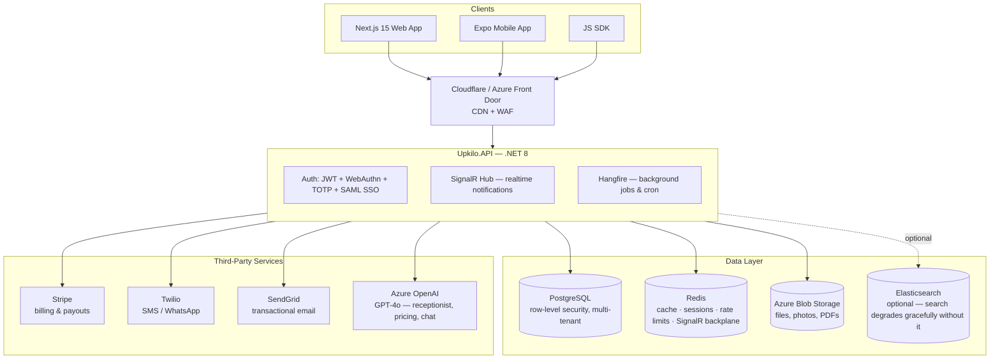

# Upkilo — AI-Powered Booking & CRM Platform

> Multi-tenant SaaS platform for service businesses. Bookings, CRM, billing, AI automation, and analytics in one stack.


## Architecture



Everything in **Backend** above runs in a single container — the API, the SignalR hub, and the Hangfire job server all share one process. There is no separate worker deployment to operate.

## Features

- **Bookings & CRM** — scheduling, waitlists, packages, memberships, client records, multi-location support
- **Billing** — Stripe subscriptions, usage-based invoicing, payouts, dunning automation
- **AI automation** (`Upkilo.AI`) — AI receptionist, voice agent, dynamic pricing, chatbot, churn-retention prompts, all backed by Azure OpenAI
- **Multi-tenant integrations** — a 14-provider catalog (Stripe, Razorpay, PayPal, SendGrid, Mailgun, Twilio, Google Calendar, Outlook, AWS S3, Google Analytics, Mixpanel, HubSpot, Slack, Zapier) with tenant-supplied credentials encrypted via AES-256-GCM — zero platform cost, bring-your-own-key
- **Security** — JWT auth, WebAuthn/Fido2 biometric login, TOTP MFA, per-tenant SAML SSO, tenant-scoped rate limiting and distributed locks
- **Realtime** — SignalR notifications backed by Redis, so it scales across multiple API instances
- **Background processing** — Hangfire (Postgres-backed, no extra infrastructure) runs 14+ recurring jobs: billing reconciliation, booking reminders, dunning, digests, audit-log retention, and more
- **Internationalization** — `next-intl`-driven locale routing on the web frontend
- **PWA + push** — installable web app with an offline-capable service worker, Web Push (VAPID) on the web, Expo Push Service on mobile (no direct Firebase/APNs integration required)
- **Search** — optional Elasticsearch; the app runs fine without it, search just falls back to plain SQL

## Tech Stack

| Layer | Technology | Notes |
|-------|-----------|---------|
| Backend API | ASP.NET Core (C#) | .NET 8 LTS, 5 projects: API / Application / Infrastructure / Core / AI |
| Frontend | Next.js (TypeScript, App Router) | 15.x, React 19, `output: standalone` for Docker |
| Mobile | React Native + Expo | Expo SDK 54, RN 0.81, managed workflow, EAS Build/Submit |
| Database | PostgreSQL | 16 (dev) / 17 (prod), row-level security for multi-tenancy |
| Connection Pool | PgBouncer | 1.23.x, transaction pooling |
| Cache / Sessions / Realtime backplane | Redis | 7.x |
| Search (optional) | Elasticsearch | 8.11.x — non-blocking health check |
| Background Jobs | Hangfire | PostgreSQL-backed, in-process with the API |
| Auth | JWT, WebAuthn (Fido2), TOTP, SAML SSO, Google OAuth | Per-tenant SSO configuration |
| AI / LLM | Azure OpenAI (GPT-4o) | Receptionist, voice agent, dynamic pricing, chat |
| Billing | Stripe | Subscriptions, Connect payouts, webhooks |
| Email | SendGrid | + SMTP fallback provider |
| SMS / WhatsApp | Twilio | |
| File Storage | Azure Blob Storage | |
| CDN / WAF | Cloudflare or Azure Front Door | |
| Error Monitoring | Sentry (frontend/mobile) + Application Insights (backend) | |
| Secrets | Azure Key Vault | |

## Quick Start

### Prerequisites

- [.NET 8 SDK](https://dotnet.microsoft.com/download)
- [Node.js 20 LTS](https://nodejs.org/)
- [Docker Desktop](https://www.docker.com/products/docker-desktop)

### 1. Clone and configure

```bash
git clone https://github.com/upkilo/upkilo.git
cd upkilo
cp .env.example .env
# Edit .env and fill in required values (see docs/DEVELOPER_GUIDE.md §5)
```

### 2. Start infrastructure

```bash
docker compose up -d
# Starts: PostgreSQL 16, PgBouncer, Redis 7, pgAdmin, Redis Commander
```

### 3. Apply database migrations

```bash
dotnet ef database update \
  --project src/backend/Upkilo.Infrastructure \
  --startup-project src/backend/Upkilo.API
```

### 4. Start the backend

```bash
cd src/backend
dotnet restore && dotnet run --project Upkilo.API
```

### 5. Start the frontend

```bash
cd src/frontend
npm install && npm run dev
```

### Local URLs

| Service | URL |
|---------|-----|
| Frontend | <http://localhost:3000> |
| Backend API | <http://localhost:5000> |
| Swagger UI | <http://localhost:5000/swagger> |
| Health check | <http://localhost:5000/health> |
| Hangfire dashboard | <http://localhost:5000/hangfire> |
| Postgres (via PgBouncer, pooled) | `localhost:6432` |
| pgAdmin | <http://localhost:5050> |
| Redis Commander | <http://localhost:8081> |

> Mailhog (SMTP capture for local email testing) isn't part of the root `docker-compose.yml` — use `infrastructure/docker/docker-compose.yml`'s `dev` profile if you need it.

## Project Structure

```
upkilo/
├── src/
│   ├── backend/
│   │   ├── Upkilo.API/             # Controllers, middleware, startup
│   │   ├── Upkilo.Application/     # CQRS handlers, validators
│   │   ├── Upkilo.Infrastructure/  # EF Core, Redis, integrations, migrations
│   │   ├── Upkilo.Core/            # Domain entities, interfaces
│   │   ├── Upkilo.AI/              # Azure OpenAI, agent orchestration
│   │   └── tests/Upkilo.Tests/     # 520 tests, 83% coverage
│   ├── frontend/                   # Next.js 15 App Router
│   ├── mobile/                     # React Native (Expo)
│   └── tools/                      # SDK, certificate generator
├── infrastructure/
│   ├── azure/                      # Bicep IaC (App Service, Postgres, Redis, Key Vault)
│   ├── docker/                     # Production-flavored Docker Compose
│   ├── prometheus/ · grafana/ · alertmanager/  # Self-hosted observability (optional)
│   └── load-testing/               # k6 performance tests
├── database/                       # Seed & perf-init SQL scripts
├── docs/                           # Architecture, API, deployment, and wiki docs
│   ├── DEVELOPER_GUIDE.md          # Full onboarding + deployment guide
│   ├── PROJECT_OVERVIEW.md         # Full architecture and feature reference
│   ├── deployment/                 # Deployment runbooks
│   └── wiki/                       # Auto-generated architecture wiki
├── _archive/                       # Superseded/historical docs, kept not deleted
├── .github/workflows/              # CI/CD (ci.yml, deploy.yml)
├── docker-compose.yml              # Dev infrastructure
└── Dockerfile                      # Multi-stage .NET 8 build
```

## Running Tests

```bash
cd src/backend
dotnet test --logger trx --collect:"XPlat Code Coverage"
```

520 tests, 83.45% line coverage. All must pass before merging.

## Deployment

`deploy.yml` builds both Docker images, pushes them to Azure Container Registry, then deploys via **Azure App Service** using a staging-slot blue/green swap:

1. Build and test the backend, build the frontend
2. Push images to Azure Container Registry
3. Back up the production database, then run EF Core migrations
4. Deploy to the staging slot, poll for health, swap into production
5. Automatic rollback (slot swap-back + schema rollback) if any step fails

See [docs/DEVELOPER_GUIDE.md](docs/DEVELOPER_GUIDE.md) for the full deployment runbook, environment variable reference, migration strategy, rollback procedure, and troubleshooting guide.

## Documentation

| Document | Purpose |
|----------|---------|
| [docs/DEVELOPER_GUIDE.md](docs/DEVELOPER_GUIDE.md) | New developer onboarding + production deployment |
| [docs/PROJECT_OVERVIEW.md](docs/PROJECT_OVERVIEW.md) | Full architecture and feature reference |
| [docs/](docs/) | API docs, architecture diagrams, wiki |

## License

Copyright © 2026 Upkilo. All rights reserved.
